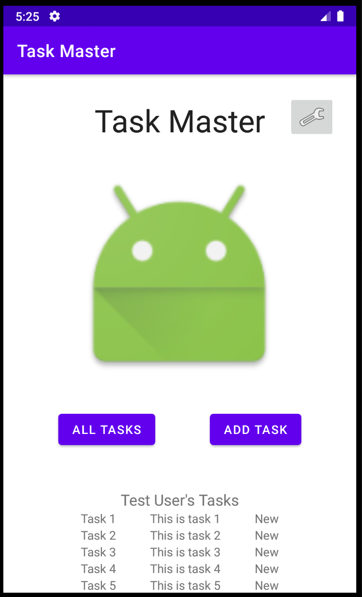
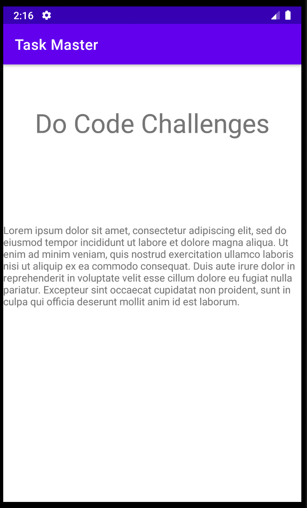

# Task Master

## Description
This is an android application that allows the user to add and keep track of current tasks that they may have.

## Screenshots
Home Page

Detail Page

### Changelog
- 1.0 *Setup and Release* - 22 October 2020 
&#9 A static landing page allows the user to navigate to a page to add new tasks or to a page to view all current tasks. Neither page has any true functionality, but acts as more of a mock up at this point.
- 1.1 *Settings and Detail Pages* - 25 October 2020 
&#9 Added a settings page that allows the user to save their username that will be displayed on the home page. There are also three hard-coded tasks visible on the home page that when clicked on show a detail page for each specific task.
- 1.2 *Recycler View on Home Page* - 25 October 2020 
&#9 Added a recycler view on the home page that acts as a scrollable view filled with some hardcoded tasks.
- 1.3 *Room Database Connection* - 26 October 2020 
&#9 The Add Task page now actually saves whatever is input into the text fields. These saved Tasks now show up on the home page in the recycler view.
- 1.4 *Espresso Testing* - 27 October 2020 
&#9 Added test using Espresso. Currently the tests make sure the MainActivity loads correctly, the username can be changed, new tasks can be saved, and new tasks can be clicked on in the recycler view and display the proper information on the additional DetailActivity page.